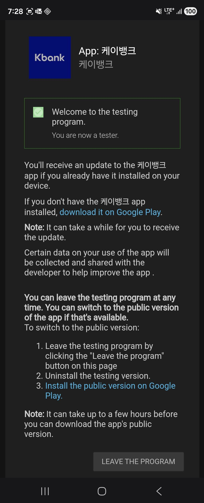

# Android 오픈 베타 앱 다운로드 가이드

Android 오픈베타 프로그램은 **사전등록된 Gmail 계정**에 한해 링크를 통해 베타 앱을 설치할 수 있습니다.  

Workflows 개인 메시지의 **Gmail 등록하기** 버튼을 클릭하여 등록해 주세요.

---

## 사전 준비 사항

-   Workflows 개인 메시지로 전달받은 내용에서 **Gmail 등록하기** 버튼을 통해 메일 사전 등록 필요.

---

## 다운로드 방법

아래의 순서로 진행하세요.

### 공개 링크 열기

Workflows 개인 메시지로 전달받은 내용에서 **Android 베타 설치하기** 버튼을 눌러주세요. 베타앱 참여 링크입니다.

### 베타 프로그램 참여

1.   **Android 베타 설치하기** 버튼을 클릭하면 Google Play 의 **베타 프로그램 참여 화면**으로 이동합니다.

2.   아래 **첫 번째 화면**에서 **"BECOME A TESTER"** 버튼을 클릭합니다.

3.   **두 번째 화면**을 확인합니다. 

4.   잠시 뒤, **세 번째 화면**처럼 Google Play Store 에서 앱이 업데이트 됩니다. 오른쪽 화면처럼 표시되지 않는 경우, 잠시 뒤 다시 시도해 주세요.

       

### 이메일이 등록되지 않은 사용자

1.   등록되지 않은 Gmail 로 **Android 베타 설치하기** 버튼을 클릭하면, 첫 번째 화면처럼 오류 메시지가 표시됩니다.
2.   두 번째 화면의 **Gmail 등록하기**를 먼저 진행해 주세요.

 

---

## 베타 테스터 탈퇴 방법

1.   Google Play Store 에서 케이뱅크 앱을 찾습니다.

     

     

2.   케이뱅크 앱을 클릭한 후, 아래로 스크롤하여 베타 테스터 **나가기** 버튼을 찾습니다.

3.   **나가기** 버튼을 클릭합니다.

4.   **"베타에서 삭제하는 중..."** 이 표시됩니다. 잠시 기다리면, **베타 테스트 프로그램에서 탈퇴**할 수 있습니다.

  

5.   베타 테스트 탈퇴 완료시, 케이뱅크(베타)에서 케이뱅크 로 변경됩니다.
6.   **베타 테스트 프로그램은 다시 참여**할 수 있습니다.

 

---

## 참고사항

-   반드시 **Google Play 스토어에 로그인된 Gmail 계정**이 등록되어 있어야 베타 앱을 설치할 수 있습니다.
-   베타 프로그램 참여 후에는 앱이 자동으로 **베타 버전**으로 업데이트됩니다.
-   필요 시 언제든지 Play 스토어에서 **베타 프로그램 탈퇴**가 가능합니다.
