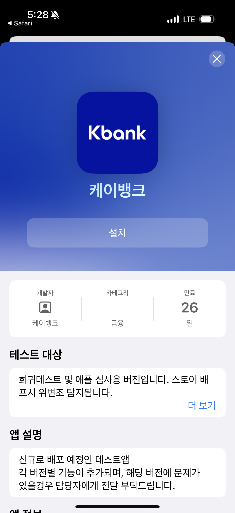
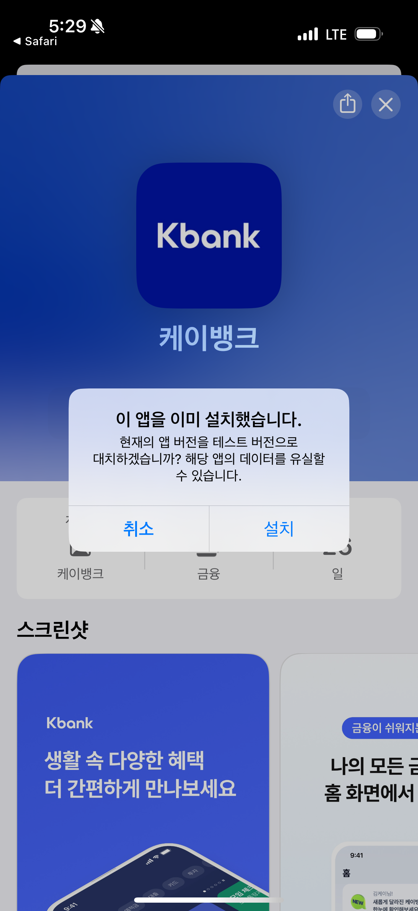

# TestFlight로 오픈베타 앱 다운로드 받는 방법

TestFlight는 iOS 앱의 베타 테스트를 쉽게 할 수 있는 애플 공식 플랫폼입니다. 공개 링크를 통해 누구나 베타 앱을 설치할 수 있습니다.

## 준비 사항
- iPhone 
- Apple ID로 로그인된 기기
- Apple App Store에서 TestFlight 앱 설치 (무료)

## 다운로드 방법

1. **공개 링크 열기**
   - 개발자가 제공한 TestFlight 공개 링크(웹 주소)를 iPhone의 Safari 또는 다른 웹 브라우저에서 엽니다.

2. **TestFlight 설치 유도**
   - 기기에 TestFlight가 설치되어 있지 않으면, 링크를 열 때 자동으로 App Store의 TestFlight 설치 페이지로 이동합니다.
   - 다운로드 클릭해서 테스트 플라이트 설치 후 열기버튼을 선택합니다.

  

3. **앱 설치 시작**
   - TestFlight 앱 설치가 완료후 앱을 실행합니다.
   - "허용" 버튼을 눌러 푸시 동의를 합니다
   - "계속" 버튼을 선택합니다
   - "동의" 버튼을 선택합니다
   - "설치" 버튼을 눌러 베타 앱을 설치합니다.

 
 

4. **앱 사용 및 업데이트**
   - "설치" 버튼을 눌러 베타앱을 다운로드 합니다.
   - "다운로드" 버튼을 눌러 베타앱을 다운로드 합니다.
   - "열기" 버튼을 눌러 베타앱을 실행합니다.
   - "다음" 버튼을 눌러 배포 내역을 확인 합니다.
   - "테스트시작" 버튼을 눌러 앱을 시작합니다.
   - 설치된 베타 앱을 일반 앱처럼 사용할 수 있습니다.
   - 새로운 빌드가 나오면 TestFlight 앱에서 업데이트 알림을 받게 됩니다.

 
 

## 참고사항
- 테스트 기간 및 빌드 유효 기간이 제한될 수 있습니다.
- iOS 버전이 베타 앱 요구사항을 충족하는지 확인하세요.
